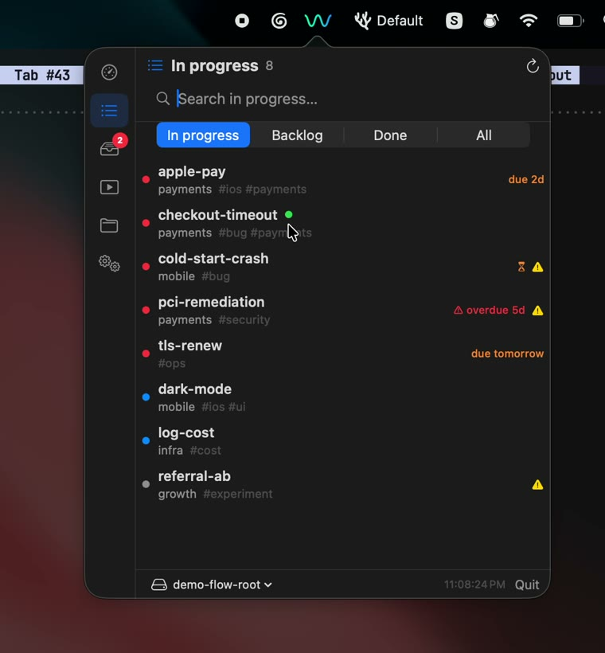

# flow-bar

A lightweight, native macOS **menubar app** for [flow](https://github.com/Facets-cloud/flow) —
see what's in flight and switch between tasks without leaving the menubar.

<p align="center">
  <a href="https://pa.github.io/flow-bar/">
    
  </a>
  <br>
  <em><a href="https://pa.github.io/flow-bar/">▶ Watch the demo</a></em>
</p>

[](LICENSE)


> flow-bar is a **companion** to the `flow` CLI — it reads your tasks through
> `flow … --format json` and switches to them with `flow do`. You need `flow`
> installed and on your `PATH`.

## Features

- **Quick task switcher** — click the menubar "w", type to filter your
  in-progress tasks, hit Enter to jump into one (`flow do` focuses the live
  tab or opens a new one).
- **Overview dashboard** — exact, at-a-glance metrics: in-progress / backlog /
  done, overdue, stale, live, plus owners, runs, and projects. Tiles are
  clickable and route to the relevant view.
- **Needs you** — owner questions, overdue, and waiting tasks in one list.
- **Projects** — per-project breakdown; drill in to see a project's tasks.
- **Playbooks** — run status and recent runs; open a run in the terminal or
  trigger a new run (new tab or background).
- **Owners** — status + next tick, parked questions, and safe pause/resume.
- **Flow roots** — switch between multiple `FLOW_ROOT`s (personal, work,
  a demo) from the footer.
- **Live activity** — the menubar icon shows a spinner while a `flow do` /
  `flow run` is opening, then a ✓ / ⚠ on completion.
- **Lightweight** — no background polling; refreshes only while open, and
  frees its caches when closed.

## Install

### Homebrew (recommended)

```sh
brew tap pa/flow-bar https://github.com/pa/flow-bar
brew install --cask flow-bar
```

### Download

Grab `flow-bar.zip` from the [latest release](https://github.com/pa/flow-bar/releases/latest),
unzip, and move `flow-bar.app` to `/Applications`. On first launch:

```sh
xattr -d com.apple.quarantine /Applications/flow-bar.app   # unsigned build
```

## Build from source

Requires the Swift toolchain (Xcode or Command Line Tools). No Xcode project —
everything is SwiftPM.

```sh
swift build                 # build all targets
swift run flowbar-tests     # run the unit tests
./build-app.sh --run        # assemble flow-bar.app and launch it
```

## Usage

Click the menubar **w**:

- **In progress** is the home tab — search and press Enter to switch.
- The left rail switches sections (Overview, Needs you, Playbooks, Projects,
  Owners).
- The footer shows the active **flow root** — use **Add Flow Root…** to point
  flow-bar at another `~/.flow`-style directory and switch between them.

The first time you switch to a task, macOS asks for **Accessibility**
permission (flow's terminal backend needs it to open the tab) — a one-time grant.

## Architecture

flow-bar treats the `flow` CLI as its API — it never touches `flow.db`
directly, so it stays schema-proof and respects flow's invariants.

- `FlowBarCore` — pure data/logic: Codable models, the `flow`/JSON bridge,
  text parsers for owners/tags, and the dashboard metrics. Unit-tested.
- `flow-bar` — the SwiftUI app: an AppKit `NSStatusItem` + `NSPopover`
  hosting the menubar UI.

See [CLAUDE.md](CLAUDE.md) for build details and conventions.

## Contributing

Issues and PRs welcome. Run `swift run flowbar-tests` before submitting.

## License

[MIT](LICENSE) © Pramodh Ayyappan
